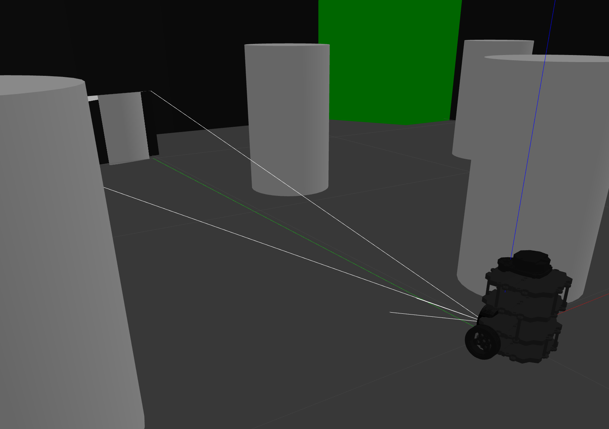
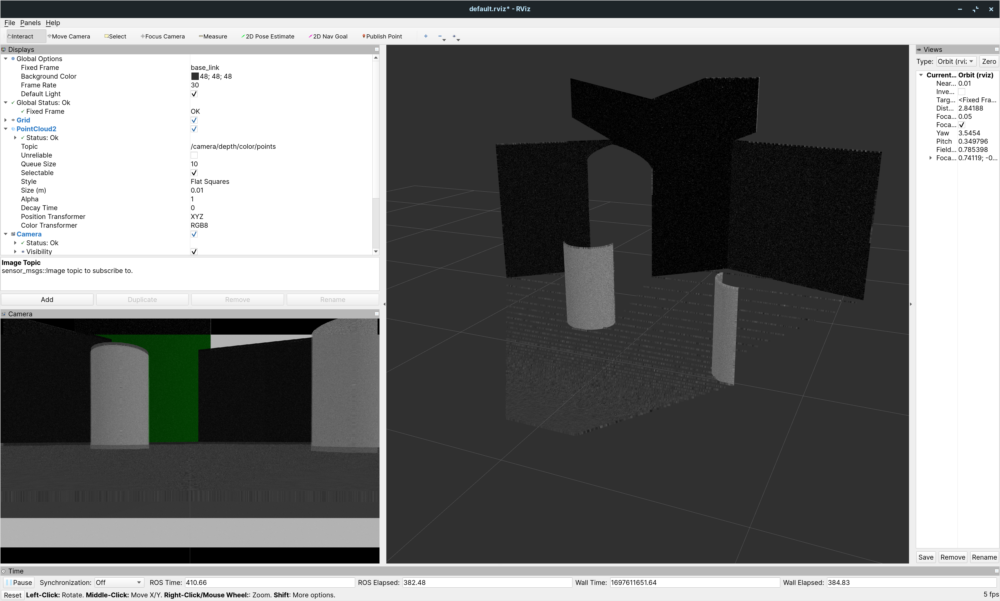
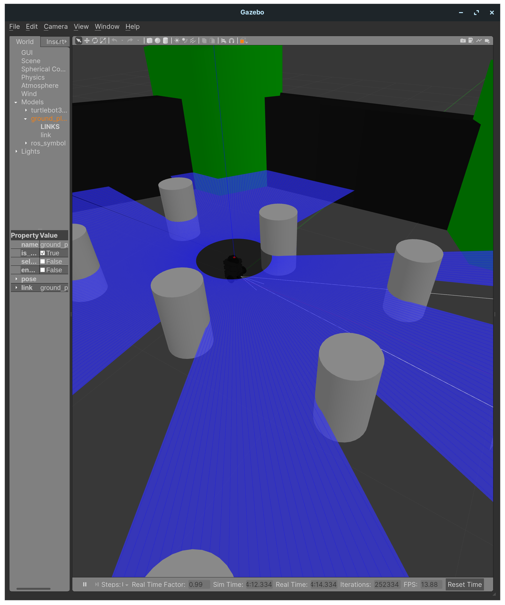
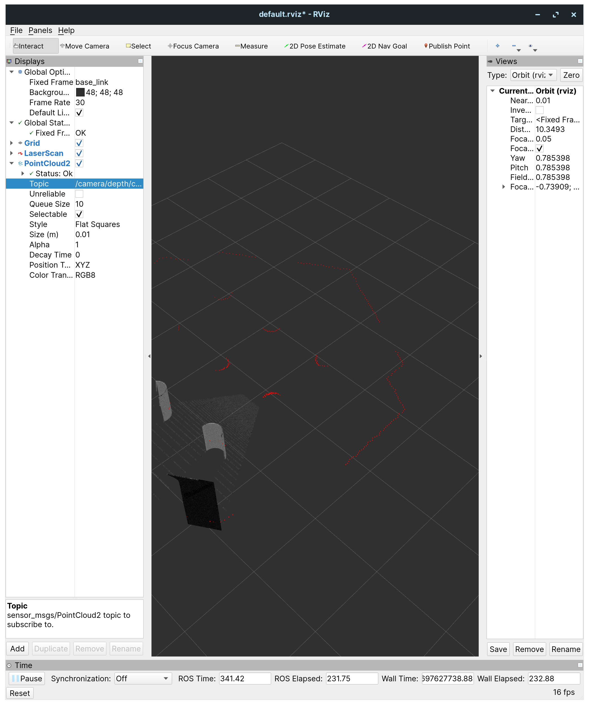

# Turtle bot sim

Using turtlebot3

`catkin_make && source devel/setup.bash`

## Running basic empty world

1. `$ export TURTLEBOT3_MODEL=burger`
2. `$ roslaunch turtlebot3_gazebo turtlebot3_empty_world.launch`

`export TURTLEBOT3_MODEL=burger; roslaunch turtlebot3_teleop turtlebot3_teleop_key.launch` for moving the bot around

Try first by adding turtlebot3 world

## Figuring out realsense cameras

- Running `https://github.com/ZohebAbai/gazebo_ros_l515.git`
- Giving both rgb and rgbd images
- Next step would be to bind it to turtlebot

## Adding camera to turtlebot

- make `catkin_ws`
- clone `https://github.com/ROBOTIS-GIT/turtlebot3_simulations/tree/noetic-devel` and all the folders of `https://github.com/ZohebAbai/gazebo_ros_l515` into src
- `catkin_make`
- source `devel/setup.bash`
- calling `roslaunch realsense2_description view_l515_model_rviz_gazebo.launch` will give realsense simulation
- calling `export TURTLEBOT3_MODEL=burger; roslaunch turtlebot3_gazebo turtlebot3_empty_world.launch` will give turtlebot simulation
- continued later

### Notes on how its working
- `roslaunch turtlebot3_gazebo turtlebot3_empty_world.launch` uses the given launch file from the `turtlebot3_gazebo` folder. 
- accesses urdf of turtlebot from `/opt/ros/noetic/share/turtlebot3_description/urdf`
- will need to add model to this file
- made new launch file for project `turtlebot3_calib.launch` that uses empty world and calls a new urdf file `turtlebot3_burger_calib.urdf.xacro`
- vizualize rviz of bot using `roslaunch turtlebot3_gazebo turtlebot3_gazebo_rviz.launch`
- currently, trying to figure out how the realsense camera sends data to rviz
- launch files in realsense2 description
	- `view_l515_model.launch`: spawns the camera and opens rviz
		- the rviz part: uses realsense's rviz
			- connects the topics to rviz
		- adds `test_l515_camera.urdf.xacro`
			- spawns base_link with model included from `_l515.urdf.xacro`
		- the `_l515.urdf/xacro` file
			- define the sensor shape and links
			- includes `_l515.gazebo.xacro` file
		- `_l515.gazebo.xacro`
			- defines topics
	- `gazebo.launch`:  spawns `test_l515_camera.urdf.xacro` in empty world
	- `view_l515_model_rviz_gazebo.launch`:
		- combines the last two things
		- set fixed frame as `base_link` -> not able to firgure out how to connect rviz
		- pointcloud2 topic: `/camera/depth/color/points`
		- 2D camera topic: `/camera/color/image_raw`
		- **NOTE**: Couldn't get rviz to work with `gazebo.launch` - getting fixed frame doesn't exist

### Topics from `turtlebot3_calib.launch`
```
/clock
/cmd_vel
/gazebo/link_states
/gazebo/model_states
/gazebo/parameter_descriptions
/gazebo/parameter_updates
/gazebo/performance_metrics
/gazebo/set_link_state
/gazebo/set_model_state
/imu
/joint_states
/odom
/rosout
/rosout_agg
/scan
/tf
```

### Topics from `gazebo.launch` of realsense
```
/camera/color/camera_info
/camera/color/image_raw
/camera/color/image_raw/compressed
/camera/color/image_raw/compressed/parameter_descriptions
/camera/color/image_raw/compressed/parameter_updates
/camera/color/image_raw/compressedDepth
/camera/color/image_raw/compressedDepth/parameter_descriptions
/camera/color/image_raw/compressedDepth/parameter_updates
/camera/color/image_raw/theora
/camera/color/image_raw/theora/parameter_descriptions
/camera/color/image_raw/theora/parameter_updates
/camera/depth/camera_info
/camera/depth/color/points
/camera/depth/image_rect_raw
/camera/depth/image_rect_raw/compressed
/camera/depth/image_rect_raw/compressed/parameter_descriptions
/camera/depth/image_rect_raw/compressed/parameter_updates
/camera/depth/image_rect_raw/compressedDepth
/camera/depth/image_rect_raw/compressedDepth/parameter_descriptions
/camera/depth/image_rect_raw/compressedDepth/parameter_updates
/camera/depth/image_rect_raw/theora
/camera/depth/image_rect_raw/theora/parameter_descriptions
/camera/depth/image_rect_raw/theora/parameter_updates
/camera/infra/camera_info
/camera/infra/image_raw
/camera/infra/image_raw/compressed
/camera/infra/image_raw/compressed/parameter_descriptions
/camera/infra/image_raw/compressed/parameter_updates
/camera/infra/image_raw/compressedDepth
/camera/infra/image_raw/compressedDepth/parameter_descriptions
/camera/infra/image_raw/compressedDepth/parameter_updates
/camera/infra/image_raw/theora
/camera/infra/image_raw/theora/parameter_descriptions
/camera/infra/image_raw/theora/parameter_updates
/clock
/gazebo/link_states
/gazebo/model_states
/gazebo/parameter_descriptions
/gazebo/parameter_updates
/gazebo/performance_metrics
/gazebo/set_link_state
/gazebo/set_model_state
/rosout
/rosout_agg
```

- using `export TURTLEBOT3_MODEL=burger; roslaunch turtlebot3_gazebo turtlebot3_calib.launch`

### Demonstration





## Adding 2D lidar

- Added `lidar.urdf.xacro` in the urdf folder of turtlebot3's description directory
- rviz visualization: Add `LaserScan` and put topic as `scan`

### Reference
- https://articulatedrobotics.xyz/mobile-robot-8-lidar/

### Demonstration





## Adding plane with checkerboard image

- Plan is to add another model of a checkerboard plane
- using https://gist.github.com/Kukanani/4b09debf29eafdd4d96c4717520e6f18 for checkerboard generation
- Added checkerboard sdf to models
- just need to drag and drop it now
- hacked the generator code to our use case
- usage: `python3 my-checkerboard-gen.py 8 8 0.13 0 1.5708 0`
- then  mv it: `mv checkerboard_* catkin_ws/src/turtlebot3_simulations/turtlebot3_gazebo/models/`

## Adding 3D lidar
- make new launch file. Use as `export TURTLEBOT3_MODEL=burger; roslaunch turtlebot3_gazebo turtlebot3_calib_3d.launch`
- added `lidar_3d.urdf.xacro` in turtlebot's description
- HERE - what should I do?

### References
- `https://automaticaddison.com/how-to-add-a-depth-camera-to-an-sdf-file-for-gazebo/`
- `https://classic.gazebosim.org/tutorials?tut=ros_depth_camera&cat=connect_ros`

## Making subscribers for the data
1. 3D calibration
	- 3D lidar topic: `/3d_lidar/depth/points`
	- camera topic: `/camera/color/image_raw`
2. 2D calibration:
	- 2D lidar topic: `/lidar/scan` - type LaserScan
	- camera topic: `/camera/color/image_raw` 

## To-do
1. Add urdf directory of tutlebot3 in git repo

## Future
1. If we want to connect IP address and port for a scanner for sick lidar: https://wiki.ros.org/sick_scan
2. 

## References
1. https://emanual.robotis.com/docs/en/platform/turtlebot3/overview/
2. https://emanual.robotis.com/docs/en/platform/turtlebot3/simulation/#gazebo-simulation
